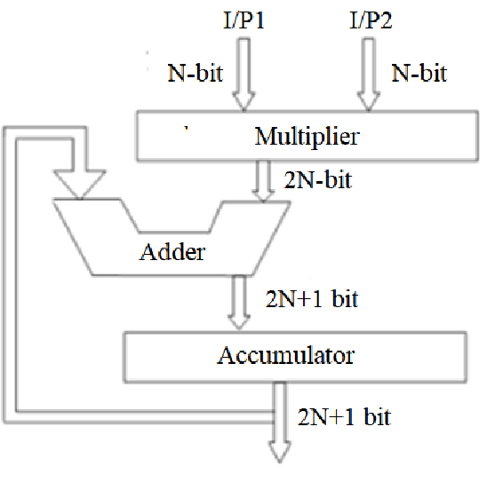
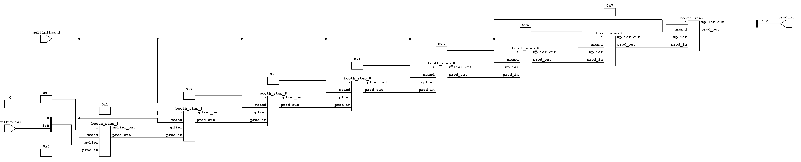
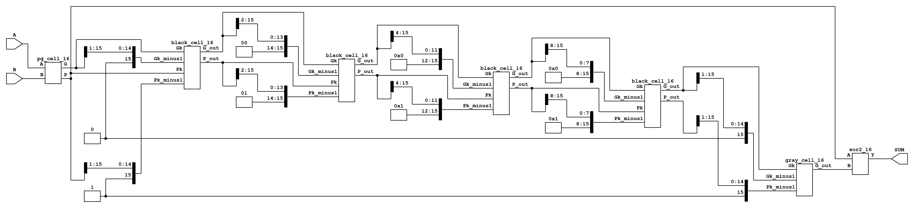
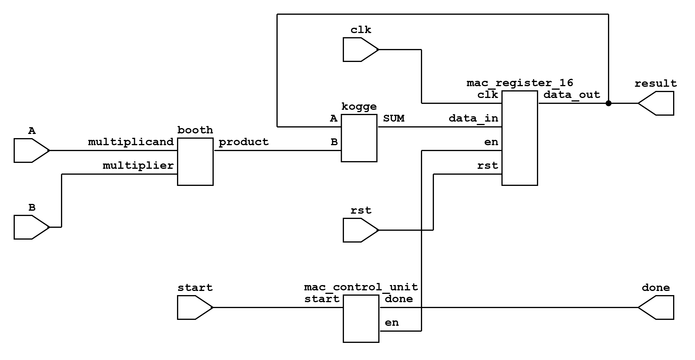

# Hardware MAC Units (Verilog)

This repository contains hardware implementations of **Multiply-Accumulate (MAC) units** and their building blocks, written in **synthesizable Verilog**.
The objective is to study and compare different **adder and multiplier architectures** in the context of datapath design for VLSI systems.

Each variant combines a **multiplier** with an **adder/accumulator strategy**, exploring design trade-offs in delay, area, and power. Additional pairs will be added over time.

---

#### MBE–CSA 

The first implemented datapath combines a **Modified Booth Multiplier (MBE)** with a **Carry-Save Adder (CSA)** to form the core of a MAC unit.

---

##### Modified Booth Multiplier (MBE)

The multiplier employs **radix-4 Booth recoding** to reduce the number of partial products.
For a multiplicand (M) and multiplier (Q), triplets of bits from (Q) are recoded into signed multiples of (M):

$$
PP =
\begin{cases}
0 & \text{if } (q_{i+1} q_i q_{i-1}) \in \{000,111\} \\
+M & \text{if } (q_{i+1} q_i q_{i-1}) \in \{001,010\} \\
+2M & \text{if } (q_{i+1} q_i q_{i-1}) = 011 \\
-2M & \text{if } (q_{i+1} q_i q_{i-1}) = 100 \\
-M  & \text{if } (q_{i+1} q_i q_{i-1}) \in \{101,110\}
\end{cases}
$$

This reduces the number of partial products by approximately half, lowering the depth of subsequent accumulation stages.

**Yosys Netlist (top-level multiplier):**

*Partial-product generation and accumulation using Modified Booth recoding.*

---

##### Carry-Save Adder (CSA)

A CSA is employed for fast accumulation of three operands without immediate carry propagation:

$$
\begin{aligned}
S_i &= A_i \oplus B_i \oplus C_i \\
C_i &= (A_iB_i) \lor (B_iC_i) \lor (C_iA_i)
\end{aligned}
$$

The outputs are a **sum vector** and a **carry vector**, which are combined later by a final adder.

**Yosys Netlist (CSA):**

*CSA datapath showing bitwise sum and carry generation.*

---

##### MAC Unit Composition

The MAC datapath integrates the MBE multiplier and CSA as follows:

1. **MBE Multiplier** computes the product ($P = A \times B$).
2. **CSA** reduces $(P, \text{Acc}_{in}, 0)$ into sum and carry vectors.
3. **Shifter** aligns the carry.
4. **Final Adder** resolves the two-vector representation into $\text{Acc}_{out}$.

$$
\text{Acc}_{out} = (A \times B) + \text{Acc}_{in}
$$

**Yosys Netlist (MAC):**

*Multiply-Accumulate unit with integrated Booth multiplier and CSA-based accumulator.*

---

##### Extension to Higher Structures

The same MAC building block can be tiled to construct larger computational units. For example:

* **Processing Element (PE):**
    
  *PE integrating a MAC with local register and forwarding logic.*

* **Systolic Array:**
    
  *Two-dimensional systolic arrangement for parallel matrix multiplication. Lower hierarchical blocks are hidden for brevity.*

---

#### Key Takeaways

* **MBE reduces multiplier partial products**, saving area and delay.
* **CSA accelerates accumulation**, deferring carry propagation to the last stage.
* The **MBE–CSA pair** represents a high-performance datapath style well-suited for MAC-intensive workloads.

Perfect — thanks for sharing the README. Here’s the **extension block** you can add after the existing `MBE–CSA` section (no repetition of old content):

---

#### Booth–Kogge

The second datapath variant combines a **Booth Multiplier** with a **Kogge–Stone Adder**, offering a contrasting trade-off between simplicity and speed compared to the first pair.

---

##### Booth Multiplier

This multiplier variant applies the classic **Booth algorithm** for signed multiplication.
Instead of generating all partial products, it inspects bit-pairs of the multiplier and selects between *addition, subtraction, or no operation* of the shifted multiplicand.

This selective accumulation reduces redundant operations and ensures correct handling of signed operands.

**Yosys Netlist (Booth Multiplier):**

*Partial-product accumulation using Booth recoding.*

---

##### Kogge–Stone Adder

The Kogge–Stone structure is a **parallel prefix adder**, optimized for logarithmic-depth carry computation.
Its stages compute **generate (G)** and **propagate (P)** signals across increasing spans of bits, allowing carry information to be distributed quickly.

The result is a very **fast adder** with predictable delay scaling, at the expense of higher wiring complexity.

**Yosys Netlist (Kogge–Stone Adder):**

*Parallel-prefix network showing generate/propagate signal flow.*

---

##### MAC Unit Composition

The MAC datapath integrates the Booth multiplier with the Kogge–Stone adder as follows:

1. **Booth Multiplier** generates a signed product ($P = A \times B$).
2. **Kogge–Stone Adder** accumulates this product with the running sum in logarithmic time.
3. **Accumulator Register** stores the updated result synchronously with the clock.

$$
\text{Acc}*{out} = (A \times B) + \text{Acc}*{in}
$$

**Yosys Netlist (MAC):**

*Multiply-Accumulate unit with Booth multiplier and Kogge–Stone adder.*

---

##### Observations

* **Booth encoding minimizes unnecessary operations** during multiplication.
* **Kogge–Stone achieves low addition delay** via parallel prefix logic.
* The **Booth–Kogge pair** balances multiplier efficiency with one of the fastest known adder structures, making it well-suited for **timing-critical datapaths**.

