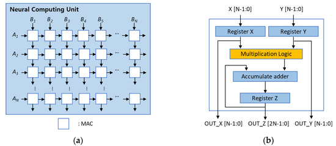
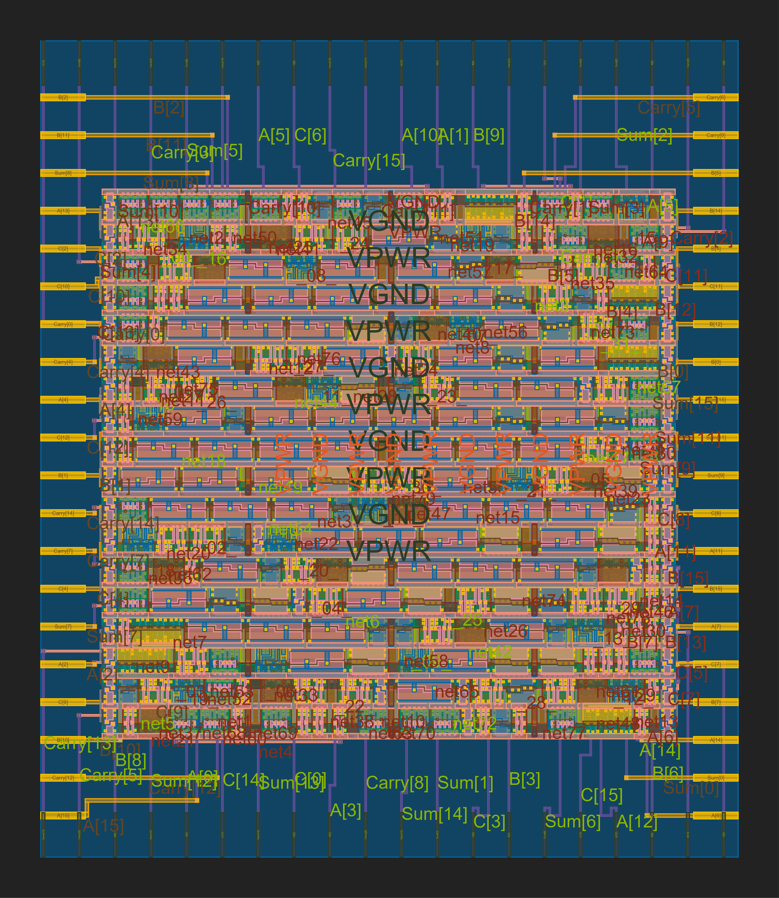
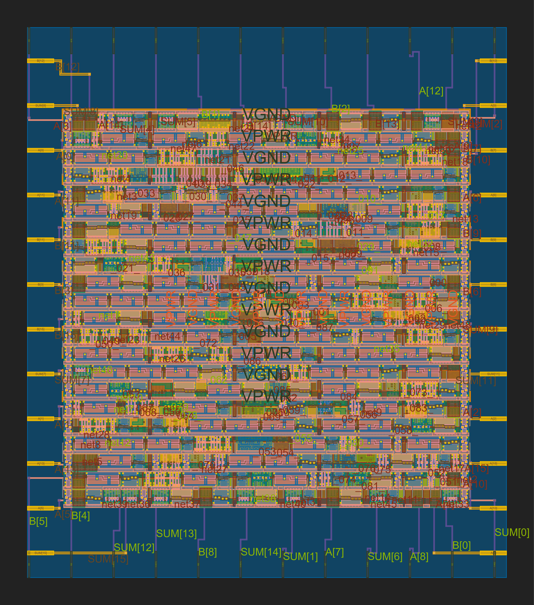
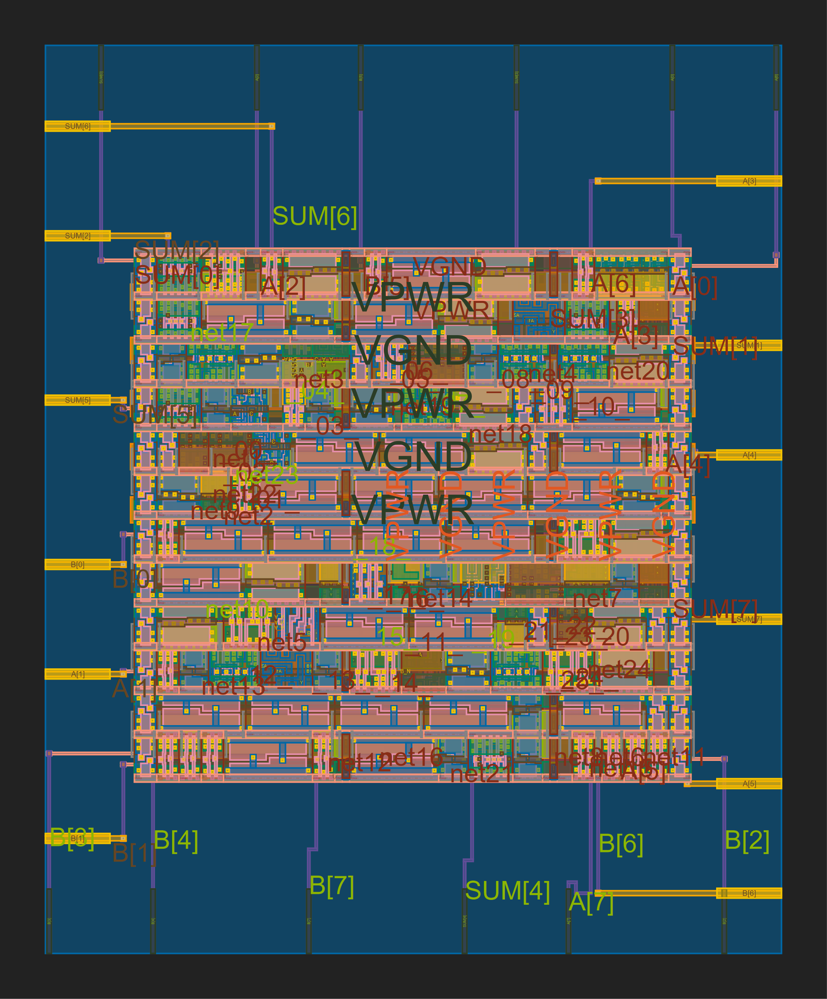
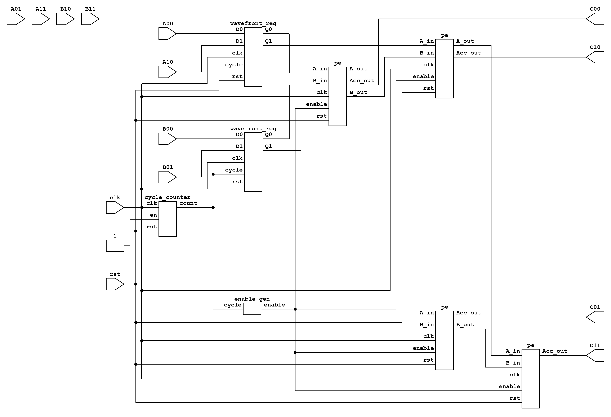

# Hardware MAC Units (Verilog)

  
   
  <em>Neural computing unit structure for calculating N×N matrix multiplication:  
  (a) Systolic-array neural computing unit;  (b) Conventional MAC architecture. 
  Source: <a href="https://www.mdpi.com/2079-9292/9/2/338">MDPI Electronics</a>.</em>

This repository contains synthesizable Verilog implementations of Multiply–Accumulate (MAC) units along with their underlying arithmetic components. The implementations enable comparative analysis of different adder and multiplier architectures in terms of hardware efficiency, computational speed, latency and many more.

All designs were evaluated under identical synthesis and layout constraints using a consistent standard-cell library and timing target

### 8-bit Signed ADDERS

#### Detailed Comparison

| Metric | CSA | Kogge–Stone | RCA |
|:--|--:|--:|--:|
| **Core Area (µm²)** | 2,522 | 3,689 | 1,126 |
| **Die Area (µm²)** | 4,604 | 6,093 | 2,572 |
| **Utilization (%)** | 54.79 | 60.54 | 43.79 |
| **Flip-Flops** | 0 | 0 | 0 |
| **Total Cells** | 64 | 110 | 34 |
| **Combinational Cells** | 64 | 110 | 34 |
| **Clock Period (ns)** | 10.00 | 10.00 | 10.00 |
| **WNS (ns)** | 0.00 | 0.00 | 0.00 |
| **TNS (ns)** | 0.00 | 0.00 | 0.00 |
| **Critical Path (ns)** | 5.07 | 6.21 | 7.14 |
| **Fmax (MHz)** | 197.24 | 161.03 | 140.06 |
| **Total Power (mW)** | 0.0834 | 0.0957 | 0.0326 |
| **Energy per Cycle (pJ)** | 0.834 | 0.957 | 0.326 |
| **Latency (ns)** | 5.07 | 6.21 | 7.14 |
| **Throughput (ops/s)** | 197,238,700 | 161,030,600 | 140,056,000 |
| **Energy per Operation (pJ)** | 422.84 | 594.30 | 232.76 |
| **Power Efficiency (ops/s per mW)** | 2,364,972,000 | 1,682,660,000 | 4,296,197,000 |
| **Area Efficiency (ops/s per µm²)** | 42,839.65 | 26,429.79 | 54,459.20 |

#### GDS Visualizations
| CSA | Kogge-Stone | RCA |
|:--:|:--:|:--:|
|  |  |  |

#### OpenROAD Layouts
| CSA | Kogge-Stone | RCA |
|:--:|:--:|:--:|
|  |  |  |

#### Key Observations

- **Critical Path and Speed:**  
  The CSA achieved the shortest delay (5.07 ns) and highest Fmax (197 MHz). Kogge-Stone followed at 161 MHz, while RCA remained the slowest at 140 MHz. The CSA’s simpler interconnect structure provided an advantage over Kogge-Stone, which suffered from wire-driven delay in its prefix tree.
- **Area and Power:**  
  RCA recorded the smallest core area (1.13×10³ µm²) and lowest power (0.0326 mW). Kogge-Stone consumed the most power and area due to its dense interconnect and logic depth.
- **Efficiency:**  
  RCA led in both power and area efficiency, while CSA balanced performance and resource usage effectively.
- **Deviation from Expected:**  
  Theoretically, Kogge-Stone should outperform CSA in delay, but practical parasitics and fanout effects favored CSA in this implementation. Otherwise, results align closely with architectural expectations.

---

### 8-bit Signed MULTIPLIERS

#### Detailed Comparison

| Metric | MBE | Booth | Baugh–Wooley |
|:--|--:|--:|--:|
| **Core Area (µm²)** | 9,594 | 14,369 | 11,911 |
| **Die Area (µm²)** | 13,094 | 18,687 | 15,827 |
| **Utilization (%)** | 73.27 | 76.89 | 75.26 |
| **Flip-Flops** | 0 | 0 | 0 |
| **Total Cells** | 294 | 470 | 374 |
| **Combinational Cells** | 294 | 470 | 374 |
| **Clock Period (ns)** | 10.00 | 10.00 | 10.00 |
| **WNS (ns)** | 0.00 | -2.50 | 0.00 |
| **TNS (ns)** | 0.00 | -15.79 | 0.00 |
| **Critical Path (ns)** | 8.84 | 12.50 | 8.63 |
| **Fmax (MHz)** | 113.12 | 80.00 | 115.87 |
| **Total Power (mW)** | 0.379 | 0.701 | 0.448 |
| **Energy per Cycle (pJ)** | 3.79 | 7.01 | 4.48 |
| **Latency (ns)** | 8.84 | 12.50 | 8.63 |
| **Throughput (ops/s)** | 113,122,200 | 80,000,000 | 115,874,900 |
| **Energy per Operation (pJ)** | 3,350.36 | 8,762.50 | 3,866.24 |
| **Power Efficiency (ops/s per mW)** | 298,475,400 | 114,122,700 | 258,649,200 |
| **Area Efficiency (ops/s per µm²)** | 8,639.16 | 4,281.08 | 7,321.29 |

#### GDS Visualizations
| MBE | Booth | Baugh–Wooley |
|:--:|:--:|:--:|
|  |  |  |

#### OpenROAD Layouts
| MBE | Booth | Baugh–Wooley |
|:--:|:--:|:--:|
|  |  |  |

#### Key Observations

- **Timing and Speed:**  
  The Baugh–Wooley multiplier achieved the shortest delay (8.63 ns) and highest Fmax (115.9 MHz), followed closely by the MBE at 8.84 ns and 113.1 MHz. Booth (Radix-2) lagged significantly with a 12.5 ns path and 80 MHz Fmax.
- **Power and Area:**  
  MBE consumed 0.379 mW, Baugh–Wooley 0.448 mW, and Booth 0.701 mW. The Booth architecture’s high switching activity and additional partial product handling resulted in elevated power and area.
- **Utilization and Cell Count:**  
  Booth required the highest number of cells (470) and utilization (76.9 %), while MBE achieved the lowest in both categories.
- **Efficiency Metrics:**  
  MBE provided the best energy per operation (3.35×10³ pJ), power efficiency (2.98×10⁸ ops/s/mW), and area efficiency (8.64×10³ ops/s/µm²).
- **Deviations from Theoretical Expectation:**  
  MBE was expected to be the most area-intensive design, but synthesis results show it as the most compact. This inversion likely stems from logic sharing and optimized radix-4 encoding realized by the synthesis tool, reducing redundant partial products.  
  Baugh–Wooley’s regular array contributed to tight routing and high timing closure, slightly outperforming MBE in delay.

---

### Summary

| Category | Adders Best | Multipliers Best |
|:--|:--:|:--:|
| **Speed / Fmax** | CSA | Baugh–Wooley / MBE |
| **Power** | RCA | MBE |
| **Area** | RCA | MBE |
| **Overall Efficiency** | RCA (compact, efficient) | MBE (most balanced) |

---

### Discussion

- The comparative results demonstrate how theoretical speed advantages can be offset by routing and interconnect parasitics in post-synthesis environments.  
- For the adders, the prefix-based Kogge-Stone suffered from wiring overhead, allowing the simpler CSA to achieve a shorter critical path.  
- For the multipliers, the Modified Booth architecture benefited from aggressive optimization and logic folding, resulting in both reduced area and improved efficiency, while Baugh–Wooley’s structured datapath yielded strong timing closure.  
- Booth’s traditional Radix-2 implementation consistently trailed across all parameters, reinforcing its inefficiency for modern arithmetic datapaths under similar constraints.

---

## MAC PAIRS

Each variant combines a **multiplier** with an **adder/accumulator strategy**, exploring design trade-offs in delay, area, and power. Additional pairs will be added over time

---

#### MBE–CSA 

The first implemented datapath combines a **Modified Booth Multiplier (MBE)** with a **Carry-Save Adder (CSA)** to form the core of a MAC unit.

---

##### Modified Booth Multiplier (MBE)

The multiplier employs **radix-4 Booth recoding** to reduce the number of partial products.
For a multiplicand (M) and multiplier (Q), triplets of bits from (Q) are recoded into signed multiples of (M):

$$
PP =
\begin{cases}
0 & \text{if } (q_{i+1} q_i q_{i-1}) \in \{000,111\} \\
+M & \text{if } (q_{i+1} q_i q_{i-1}) \in \{001,010\} \\
+2M & \text{if } (q_{i+1} q_i q_{i-1}) = 011 \\
-2M & \text{if } (q_{i+1} q_i q_{i-1}) = 100 \\
-M  & \text{if } (q_{i+1} q_i q_{i-1}) \in \{101,110\}
\end{cases}
$$

This reduces the number of partial products by approximately half, lowering the depth of subsequent accumulation stages.

**Yosys Netlist (top-level multiplier):**

*Partial-product generation and accumulation using Modified Booth recoding.*

---

##### Carry-Save Adder (CSA)

A CSA is employed for fast accumulation of three operands without immediate carry propagation:

$$
\begin{aligned}
S_i &= A_i \oplus B_i \oplus C_i \\
C_i &= (A_iB_i) \lor (B_iC_i) \lor (C_iA_i)
\end{aligned}
$$

The outputs are a **sum vector** and a **carry vector**, which are combined later by a final adder.

**Yosys Netlist (CSA):**

*CSA datapath showing bitwise sum and carry generation.*

---

##### MAC Unit Composition

The MAC datapath integrates the MBE multiplier and CSA as follows:

1. **MBE Multiplier** computes the product ($P = A \times B$).
2. **CSA** reduces $(P, \text{Acc}_{in}, 0)$ into sum and carry vectors.
3. **Shifter** aligns the carry.
4. **Final Adder** resolves the two-vector representation into $\text{Acc}_{out}$.

$$
\text{Acc}_{out} = (A \times B) + \text{Acc}_{in}
$$

**Yosys Netlist (MAC):**

*Multiply-Accumulate unit with integrated Booth multiplier and CSA-based accumulator.*

---

##### Extension to Higher Structures

The same MAC building block can be tiled to construct larger computational units. For example:

* **Processing Element (PE):**
    
  *PE integrating a MAC with local register and forwarding logic.*

* **Systolic Array:**
    
  *Two-dimensional systolic arrangement for parallel matrix multiplication. Lower hierarchical blocks are hidden for brevity.*

---

#### Key Takeaways

* **MBE reduces multiplier partial products**, saving area and delay.
* **CSA accelerates accumulation**, deferring carry propagation to the last stage.
* The **MBE–CSA pair** represents a high-performance datapath style well-suited for MAC-intensive workloads.

---

#### Booth–Kogge

The second datapath variant combines a **Booth Multiplier** with a **Kogge–Stone Adder**, offering a contrasting trade-off between simplicity and speed compared to the first pair.

---

##### Booth Multiplier

This multiplier variant applies the classic **Booth algorithm** for signed multiplication.
Instead of generating all partial products, it inspects bit-pairs of the multiplier and selects between *addition, subtraction, or no operation* of the shifted multiplicand.

This selective accumulation reduces redundant operations and ensures correct handling of signed operands.

**Yosys Netlist (Booth Multiplier):**

*Partial-product accumulation using Booth recoding.*

---

##### Kogge–Stone Adder

The Kogge–Stone structure is a **parallel prefix adder**, optimized for logarithmic-depth carry computation.
Its stages compute **generate (G)** and **propagate (P)** signals across increasing spans of bits, allowing carry information to be distributed quickly.

The result is a very **fast adder** with predictable delay scaling, at the expense of higher wiring complexity.

**Yosys Netlist (Kogge–Stone Adder):**

*Parallel-prefix network showing generate/propagate signal flow.*

---

##### MAC Unit Composition

The MAC datapath integrates the Booth multiplier with the Kogge–Stone adder as follows:

1. **Booth Multiplier** generates a signed product ($P = A \times B$).
2. **Kogge–Stone Adder** accumulates this product with the running sum in logarithmic time.
3. **Accumulator Register** stores the updated result synchronously with the clock.

$$
\text{Acc}*{out} = (A \times B) + \text{Acc}*{in}
$$

**Yosys Netlist (MAC):**

*Multiply-Accumulate unit with Booth multiplier and Kogge–Stone adder.*

---

##### Observations

* **Booth encoding minimizes unnecessary operations** during multiplication.
* **Kogge–Stone achieves low addition delay** via parallel prefix logic.
* The **Booth–Kogge pair** balances multiplier efficiency with one of the fastest known adder structures, making it well-suited for **timing-critical datapaths**.

---

Here’s the **math-heavy extension block** you can add for the **Baugh–Wooley Multiplier + Ripple-Carry Adder** pair (structured like the earlier ones but with more LaTeX detail):

---

#### Baugh–Wooley – Ripple-Carry

The third datapath variant combines a **Baugh–Wooley signed multiplier** with a **Ripple-Carry Adder (RCA)**.
This pair emphasizes simplicity and clarity of two’s complement arithmetic, providing a canonical baseline for comparison against more advanced structures.

---

##### Baugh–Wooley Multiplier

The **Baugh–Wooley algorithm** ensures that signed multiplication in **two’s complement** form can be performed using only **positive-weighted partial products**.

For two signed numbers of width $n$:

$$
[
A = -a_{n-1}2^{n-1} + \sum_{i=0}^{n-2} a_i 2^i
]
$$

$$
[
B = -b_{n-1}2^{n-1} + \sum_{j=0}^{n-2} b_j 2^j
]
$$

The product is:

$$
[
P = A \cdot B
= \Big( -a_{n-1}2^{n-1} + \sum_{i=0}^{n-2} a_i 2^i \Big)
\Big( -b_{n-1}2^{n-1} + \sum_{j=0}^{n-2} b_j 2^j \Big)
]
$$

Expanding yields four groups of terms:

1. **Positive partial products** ($a_i b_j 2^{i+j}$).
2. **Negative correction terms** involving the MSBs ($-a_{n-1} b_j 2^{n-1+j}$ and $-b_{n-1} a_i 2^{n-1+i}$).
3. **Double-negation MSB term** ($a_{n-1} b_{n-1} 2^{2n-2}$).

The Baugh–Wooley technique *rearranges* the negative terms into a positive-weighted structure by complementing and adding correction bits, allowing the hardware to be realized with a uniform partial-product matrix.

Thus, the hardware can generate all $n^2$ partial products as if operands were unsigned, with small **bit inversions and constant additions** correcting the two’s complement behavior.

**Yosys Netlist (Baugh–Wooley Multiplier):**

*Signed multiplication in two’s complement via positive partial-product rearrangement.*

---

##### Ripple-Carry Adder (RCA)

The RCA is the simplest form of binary adder. For two $n$-bit operands $A = (A_{n-1},\dots,A_0)$ and $B = (B_{n-1},\dots,B_0)$, each bit position computes:

$$
[
\begin{aligned}
S_i &= A_i \oplus B_i \oplus C_i \
C_{i+1} &= (A_i B_i) + (B_i C_i) + (C_i A_i)
\end{aligned}
]
$$

with initial carry $C_0 = 0$.

The total delay is proportional to $O(n)$, since each carry must ripple sequentially through all stages.
While slow compared to logarithmic adders, the RCA has minimal area and wiring complexity.

**Yosys Netlist (Ripple-Carry Adder):**

*Bitwise full-adder chain propagating carry serially from LSB to MSB.*

---

##### MAC Unit Composition

The MAC datapath integrates the Baugh–Wooley multiplier with the ripple-carry adder:

1. **Baugh–Wooley Multiplier** computes a signed product $P = A \times B$ using a correction-free partial product array.
2. **Ripple-Carry Adder** accumulates the product with the current running sum:

$$
[
\text{Acc}*{out} = \text{Acc}*{in} + (A \times B)
]
$$

3. **Accumulator Register** stores the updated result synchronously.

**Yosys Netlist (MAC):**

*Multiply-Accumulate datapath using Baugh–Wooley multiplier and ripple-carry adder.*

---

##### Observations

* **Baugh–Wooley ensures correctness** of two’s complement multiplication with uniform hardware structure.
* **Ripple-Carry Adder has $O(n)$ delay**, making it the simplest but slowest accumulation method.
* The **Baugh–Wooley – RCA pair** represents a **baseline reference design**: easy to implement and area-efficient, but limited in performance.

---

